# 1. Installation & Setup

The Kassow robot vision example requires installing specific CBuns (Custom Bundles) and configuring the network connection to the Machine Vision Device.

## Supported controllers

| Controller | Minimum software version | Notes |
| --- | --- | --- |
| KR Series | FireFly 4.1 | Tested with Robot Controller AC PROFINET and KR0810 |
| Edge Edition | FireFly | Compatible with the CBun and example program |

## Files

Download the robot example from this [GitHub repository](https://github.com/wenglor/robot-vision-kassow-robots/tree/main/sources/). It consists of:

- `wenglor_vision_1.1.0.kr2` — the example program file that demonstrates the vision interface usage
- `wenglor_vision_devices_1.1.0.cbun` — the CBun that provides the wenglor vision device node with API methods

## Network configuration

Configure the network settings of the Kassow robot controller so it can reach the Machine Vision Device (by default `192.168.100.1`).

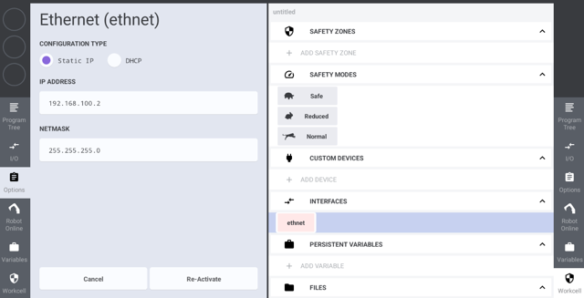

Ensure that:
- The robot controller and vision device are on the same network
- The IP address of the vision device is accessible from the robot controller
- No firewall rules block the communication (default port: `32006`)

!!! note

    On the Machine Vision Device website (Tab `Jobs` → `Robot Server`), make sure the robot server is active and the robot manufacturer is set to **Kassow Robots**. See [Settings on Device Website](https://wenglor.github.io/robot-vision-generic-string/4_0_robot_vision_server/4_3_0_settings_on_device_website/) in the wenglor robot vision manual.

## Set Payload and TCP
To set the payload and the TCP for the tool, go to variables and select payload or TCP.
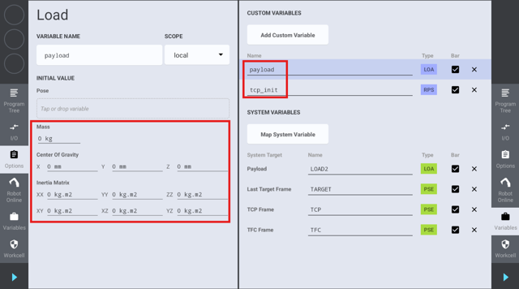

## CBun Installation

Install the relevant CBuns in order to use the robot example program:

- `System Utils` for `Program Control`
- `wenglor vision devices`

## System Utils for Program Control

In the robot example program, the System Utils CBun is required in order to exit the program execution if some conditions are not met.

Navigate to the CBun view to add or remove CBuns.

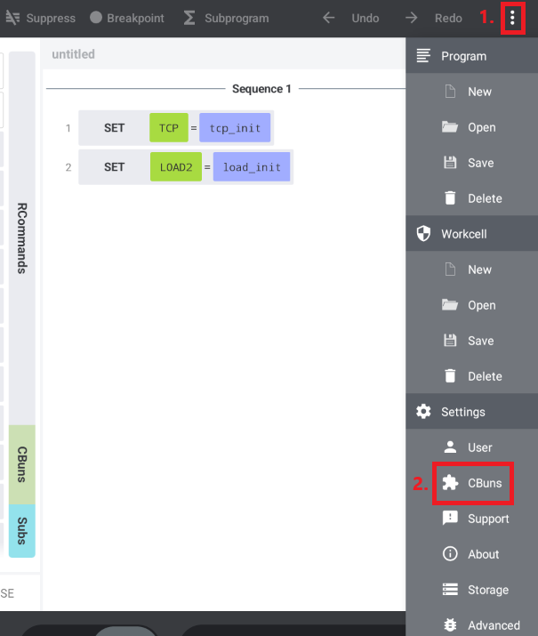

Click on the + icon to install a CBun.

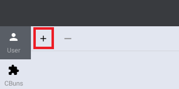

Install `system_utils`. It should be available on the robot controller. Otherwise, contact your Kassow Robots partner.

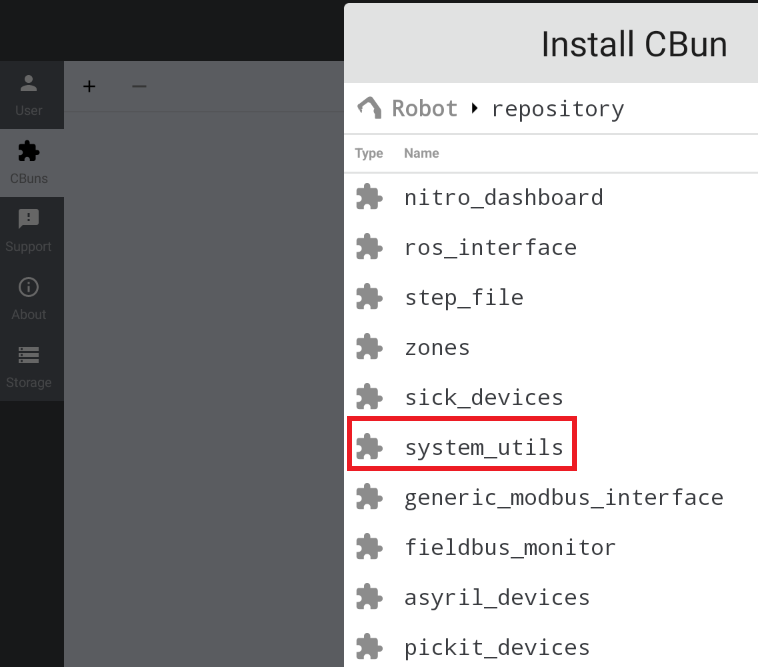

Add the method Program Control from the System Utils CBun.

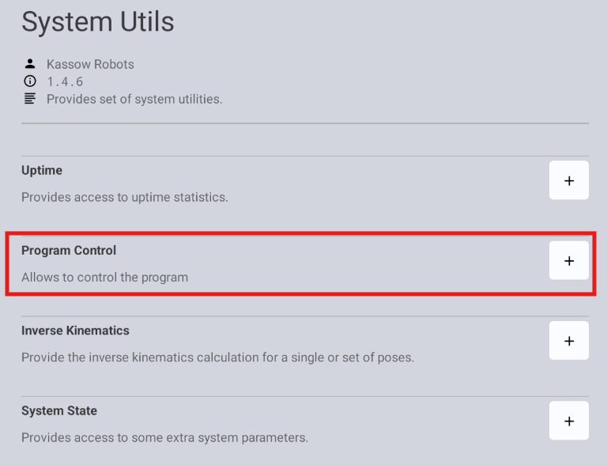

Activate the Program Control Custom Device with its default configuration.

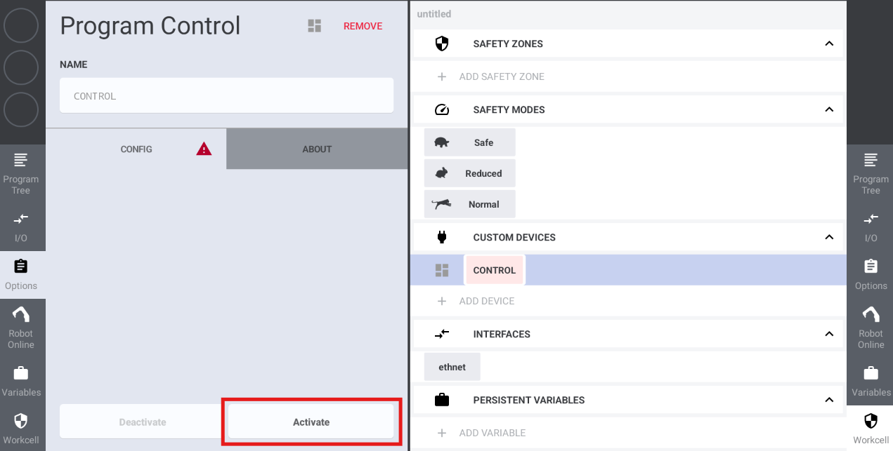

## wenglor CBun

Download the latest wenglor CBun version from this [GitHub repository](https://github.com/wenglor/robot-vision-kassow-robots/tree/main/sources/) and put the files on a freshly formatted stick.

Plug in the USB stick in the robot controller. Click on Robot → SHARED to install the wenglor CBun from the USB stick.

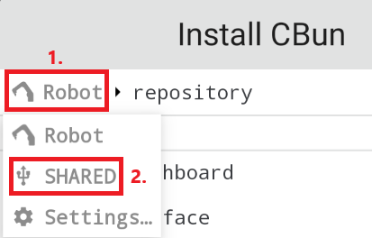

Select `wenglor_vision_devices` to install it.

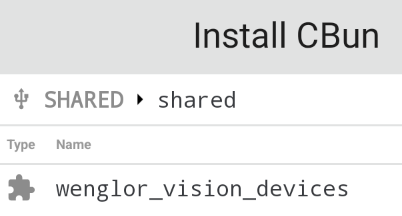

Click on the + icon to add the wenglor vision device.

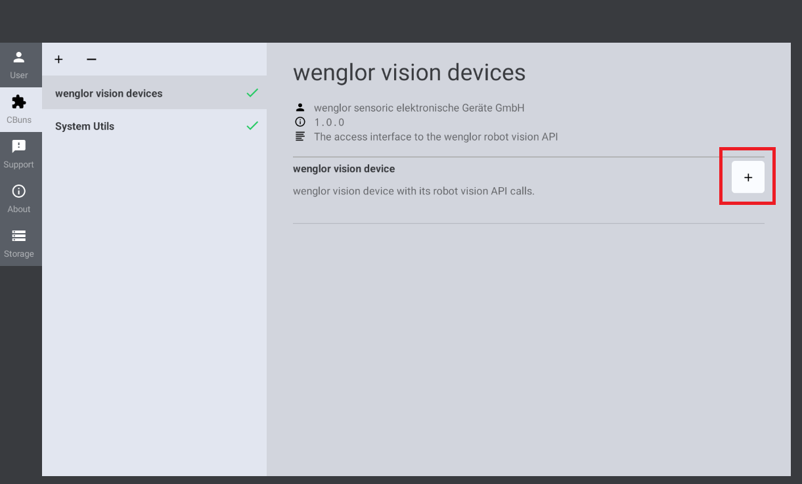

Activate the wenglor vision device in order to initiate a connection from the robot controller to the vision device.

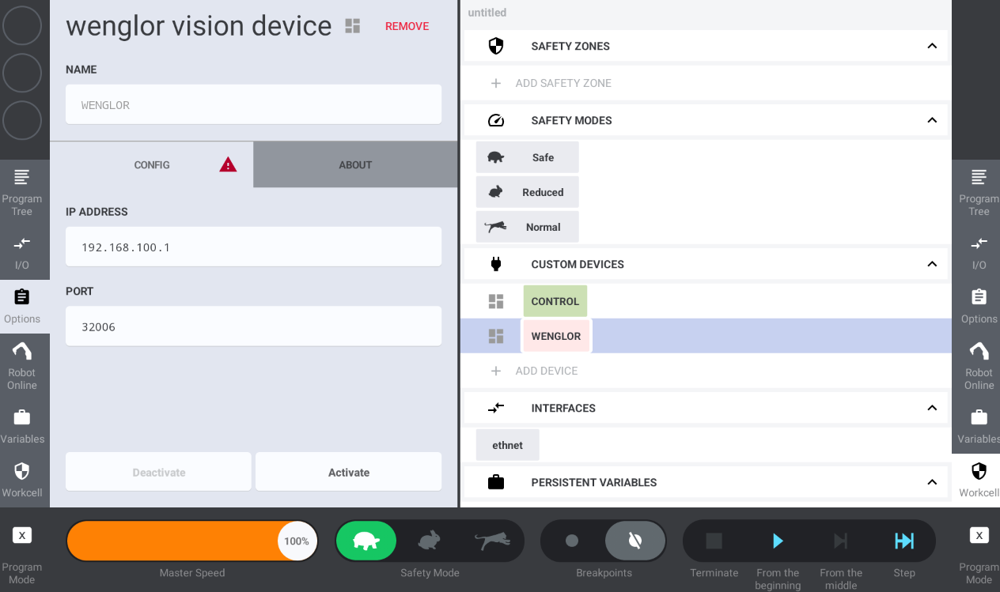

In case of a valid network configuration to the Machine Vision Device, the device is activated successfully.

!!! note

    - The connection is only maintained during the program execution. So the Workcell state might become outdated.
    - Check the status for the robot connection on the device website of the Machine Vision Device (Tab `Jobs` → `Robot Server`, see [chapter 4.2 Settings on Device Website](https://wenglor.github.io/robot-vision-generic-string/4_0_robot_vision_server/4_3_0_settings_on_device_website/)).

## Loading the program

After installing the CBuns and configuring the network, load the example program `wenglor_vision_1.1.0.kr2` from the USB stick to the robot controller. The program is then ready to be configured and executed.

For configuration details, see [User Configuration](2_0_0_user_configuration.md).
