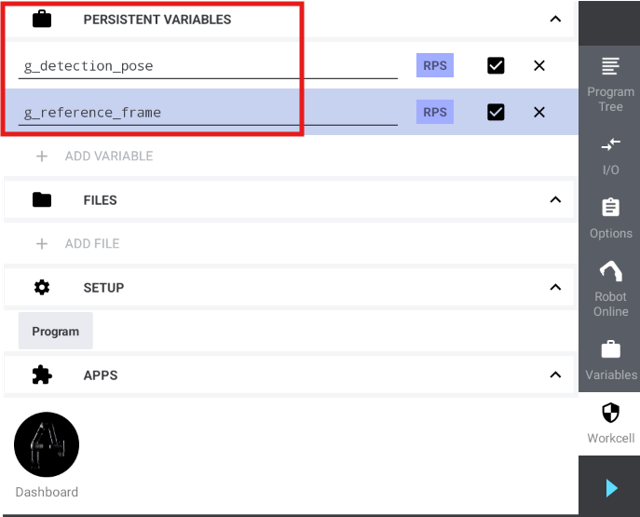
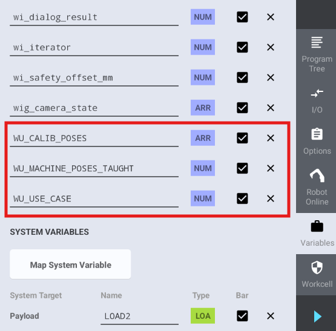
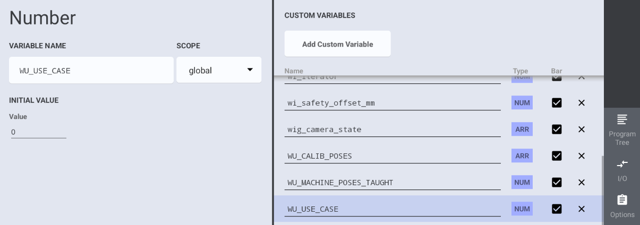
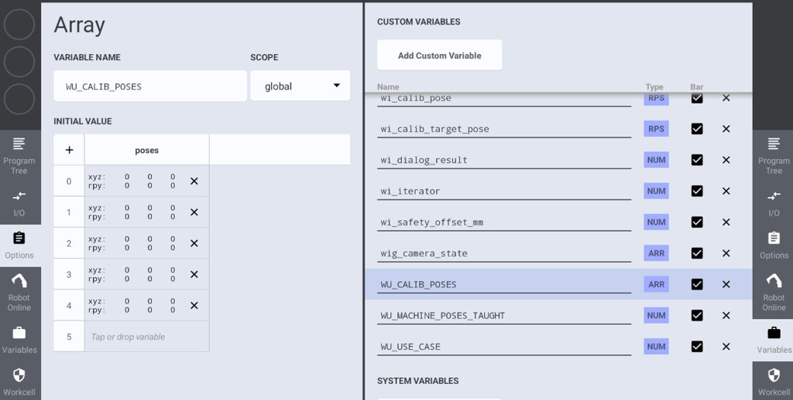

# 2. User Configuration

The robot program requires configuration of workcell variables and program variables to match your specific setup. This section describes all parameters you need to adapt.

## Workcell Variables

For the program execution, two persistent and global variables are required in the workcell. Add them manually to the workspace.

| Variable name | Type | Function |
|--------------------|------|----------|
| `g_detection_pose` | Pose | The pose that triggers the detection. Also used as a retreat pose for calibration step 2 if the camera is not mounted on the robot. The robot will move there, so you can remove the calibration plate to place it on the object ground. |
| `g_reference_frame` | Pose | The pose that is used as a reference frame for other poses. It is updated in the program to also update the related poses. |

Add the variables in the Workcell as persistent variables.

## Program Variables

Open the program from the USB stick to set up the program variables.

### Boolean parameters

| Parameter | Description |
| --- | --- |
| `WU_MACHINE_POSES_TAUGHT` | Used within the `update_reference_frame` use case to stop the program so the related poses for the reference frame can be taught after the initial reference frame was set. After teaching the poses, set this value to `1`. |

### Numerical parameters

| Parameter | Description |
| --- | --- |
| `WU_USE_CASE` | A numeric flag to indicate where the camera is mounted: <ul><li>`0`: Camera is mounted on the robot</li><li>`1`: Camera is not mounted on the robot</li></ul> |

### Pose parameters

| Parameter | Description |
| --- | --- |
| `WU_CALIB_POSES` | An array of the calibration poses. During the calibration procedure, the program iterates through the poses. You can add, remove or update poses here. A minimum number of five poses is required. |

### String parameters (uniVision job names)

The following uniVision job names are used by default. If using different job names, update them in the program at the specified locations:

| Parameter | Default value | Description | Update location |
| --- | --- | --- | --- |
| Calibration job | `calibration.u3p` | Name of the uniVision job for calibration | At the beginning of the subprogram `run_calibration` |
| Detection job | `find_objects.u3p` | Name of the uniVision job for object detection | `single_detection` and `multi_detection` subprograms |
| Target detection job | `find_target.u3p` | Name of the uniVision job for detecting calibration target | `update_reference_frame` subprogram |

### Calibration target

The calibration target must be set in the program for the following commands. If using a different calibration target, update it in the program at the specified locations:

| Command | Description | Update location |
| --- | --- | --- |
| `Calculate Calibration` | Sets the calibration target used to calculate the hand-eye calibration. | `run_calibration` subprogram |
| `Calibrate Ground` | Sets the calibration target used for the second calibration step (camera not mounted on the robot). | `run_calibration` subprogram |
| `Calibrate Target` | Sets the calibration target used to calibrate the camera-to-target relation. | `update_reference_frame` subprogram |
| `Get Target Pose` | Sets the calibration target used to detect the target pose. | `update_reference_frame` subprogram |
