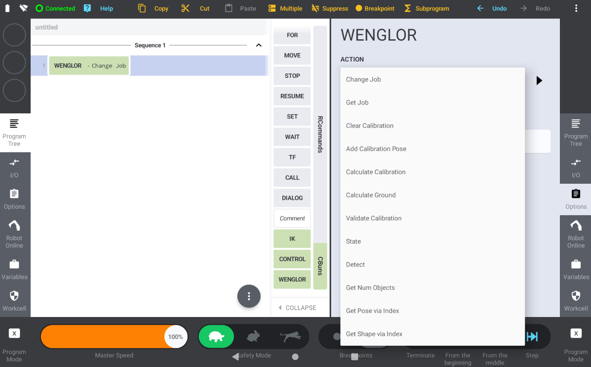
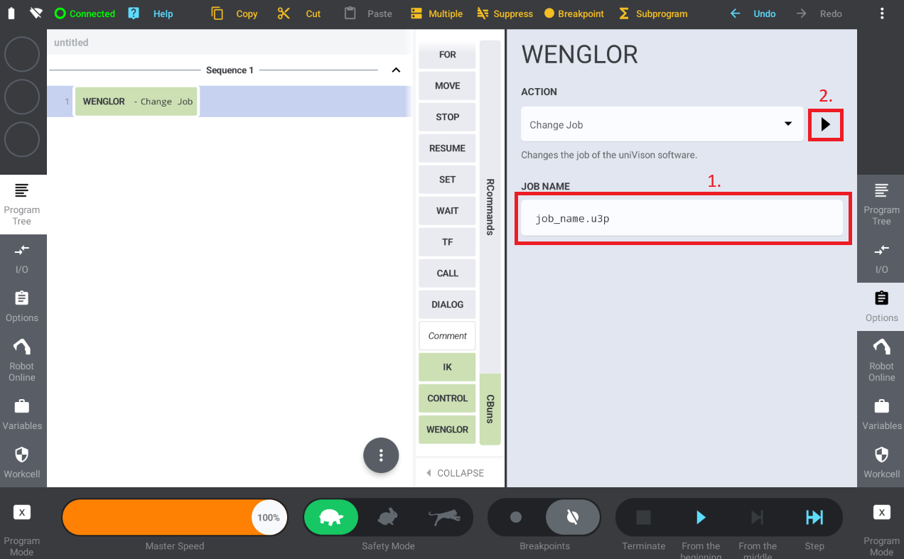
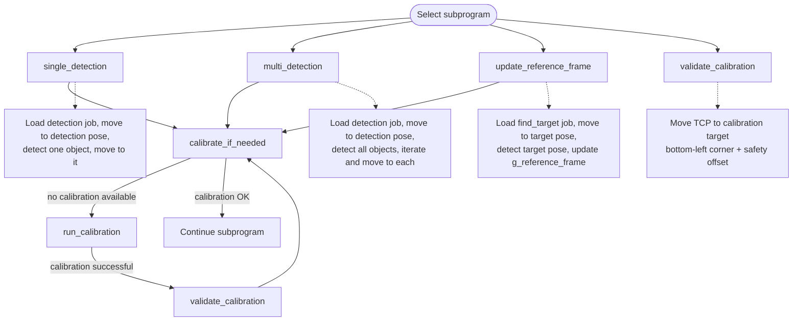
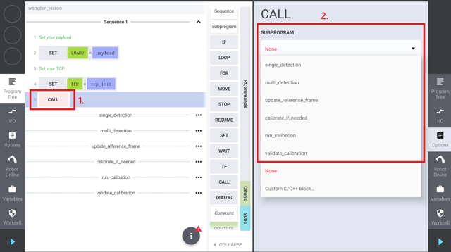

# 3. Robot Program

The example program implements a complete robot vision workflow: calibrating the camera to the robot, detecting objects, and moving to them. The program uses the wenglor vision device CBun to communicate with the Machine Vision Device.

## The wenglor device node

With the wenglor device you have access to all method calls of the robot vision API (see [Generic Robot Vision Interface](https://wenglor.github.io/robot-vision-generic-string/4_7_0_generic_robot_vision_interface/)).

All methods of the wenglor node provide a test option that executes the method without the need of a robot program. To execute the method, in this case a job change, enter the desired job name and hit the play button.

## Program structure

The example program is organized into subprograms that handle different aspects of the robot vision workflow:

/// html | div.col-widths
    attrs: {style: "--w1: 30%; --w2: 70%;"}
| Subprogram | Responsibility |
| --- | --- |
| `calibrate_if_needed` | Checks the camera state for errors and the calibration state. In case of no available calibration, it calls the `run_calibration` subprogram. After the calibration program, it checks the state again to see if the calibration was successful. |
| `single_detection` | Calls `calibrate_if_needed` first. Loads the detection job, moves the robot to the detection pose and triggers the object detection. After this, the robot moves in a linear movement to the object. Even if multiple objects are detected, the subprogram will only move to one object. |
| `multi_detection` | Calls `calibrate_if_needed` first. Loads the detection job, moves the robot to the detection pose and triggers the object detection. Then it iterates through the object information via an index accessor and moves the robot to all of the objects. |
| `update_reference_frame` | Calls `calibrate_if_needed` first. Loads the `find_target` job and moves the robot to the pose where the camera can see the calibration target. Then it detects the calibration target pose and writes it into the persistent `g_reference_frame` variable. If the poses in the machine related to the reference frame are not taught yet, the program will stop. If you execute the subroutine again after setting `WU_MACHINE_POSES_TAUGHT`, it will also move to the updated poses in the machine. You need to add your poses at the bottom of this subroutine. |
| `run_calibration` | Clears the temporary calibration data (not the calibration itself), loads the calibration job, and moves the robot to the calibration poses. Then it calculates the calibration. If the camera is not mounted on the robot, it performs the second calibration step to calibrate the camera to object ground level. On success, `calibrate_if_needed` automatically calls `validate_calibration` afterward. |
| `validate_calibration` | Checks the calibration results by moving the robot TCP to the bottom left corner of the calibration target. As the camera is not triggered again, it is important that the calibration target was not moved between the calibration and the validation. For safety reasons, enter a safety offset (in mm) before the movement. This safety offset shifts the target pose above the calibration target. |
///

The following diagram shows how the subprograms call each other, starting from the selected entry point:

## Calibration

The calibration process differs depending on whether the camera is mounted on the robot or not. The sections below describe only how the **Kassow example** performs each case.

!!! note

    For the general calibration concepts — which calibration plate to use, how to choose and vary the poses, and how to read the reprojection error — see the [Wenglor Robot Server overview](https://wenglor.github.io/robot-vision-generic-string/4_0_0_robot_vision_server/) in the wenglor robot vision manual. The description here does not repeat them.

### Camera on robot

Teach a minimum of five calibration poses (seven to eleven for better accuracy). The **first calibration pose is also the detection pose** — choose a pose from which the objects can be reached safely.

### Camera not on robot

The calibration consists of two steps:

1. Mount the calibration plate on the robot and teach a minimum of five calibration poses.
2. Place the calibration plate on the measuring/picking plane and capture one single image (the robot moves to the detection pose so it does not block the plate).

### Verification

After calibration, `validate_calibration` performs an optional verification step: it moves the robot TCP to the bottom-left corner of the calibration plate, offset upward by the safety offset, so the operator can visually confirm accuracy. The calibration plate must not be moved between calibration and verification.

!!! note

    For what a good calibration looks like (Z-axis orientation, expected reprojection error values), see the [Wenglor Robot Server overview](https://wenglor.github.io/robot-vision-generic-string/4_0_0_robot_vision_server/) in the wenglor robot vision manual.

## Detection

After successful calibration, the program picks objects. After the camera sends the object position, the robot moves to the object pose.

### `single_detection`

Loads the detection job, moves to the detection pose, requests a single object pose, and moves to it.

### `multi_detection`

Fills the camera-side buffer, reads the number of objects, and iterates over all detected objects.

You can extend this with conditional checks on the shape model or additional value (link the additional value in the uniVision job before using it).

### `update_reference_frame`

Used for mobile platforms and similar use cases (e.g. correcting positional deviations of a mobile platform in front of a machine or shelf). It detects the calibration target, updates `g_reference_frame`, and — once the machine poses have been taught relative to that frame — moves to them.

On the first run, set the poses relative to `g_reference_frame`, then set `WU_MACHINE_POSES_TAUGHT` to `1` and restart.

Internally, this subprogram calls the `target:pose` command of the generic robot vision API to obtain the calibration target's pose. See [4.6 Target Pose and Camera-to-Target Calibration](https://wenglor.github.io/robot-vision-generic-string/4_6_0_target_pose_and_camera_to_target/) in the wenglor robot vision manual for the underlying job setup and command details.

## Update the example program

The robot program requires small adjustments depending on the use case — see [User Configuration → Calibration target](2_0_0_user_configuration.md#calibration-target) and [User Configuration → String parameters (uniVision job names)](2_0_0_user_configuration.md#string-parameters-univision-job-names) to set the calibration target and job names for your setup.

## Run the program

After configuration, run the program. Several dialogs guide you through the process. The example program is just an example — adjust it to your needs.

Select the subprogram to execute.

